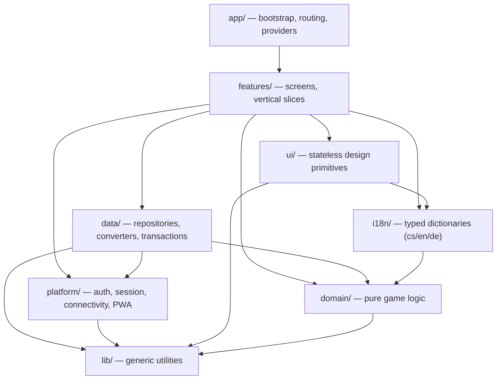

# Kwest

A mobile-first Progressive Web App for groups of people spending a few days together —
a trip, a retreat, a camp — who want to complete side quests and cause each other a bit of
mischief. Installable on Android, iOS and desktop.

Everyone joins a shared group. Each day players pick a task, earn coins for finishing it, and
spend those coins on rewards — many of which are small punishments aimed at everyone else.
Who reserved which task and who bid on which reward stays secret during the day; every evening
one admin runs a single day evaluation that settles the day, reveals who won what, and
advances the game to the next round.

## No backend

There is no server and no Cloud Functions to run, deploy or pay for.
[Firestore](https://firebase.google.com/docs/firestore) with Anonymous Auth is the single
source of truth, and every authorization decision lives in Firestore Security Rules, the
app talks to the database directly, and the rules alone decide what each player may read or
write. `onSnapshot` keeps every screen live, so there is no Redux/Zustand/query cache for
server state. The whole design is meant to fit comfortably inside Firebase's free tier, and
because it's a PWA it installs to the home screen and loads instantly from cache.

## Tech stack

- **Vite + React 19 + TypeScript** (strict) with `react-router-dom`
- **Tailwind CSS** with semantic design tokens (light + dark)
- **Firebase** — Firestore + Anonymous Auth (modular SDK), nothing else
- **zod** validates everything read from Firestore
- **Vitest** + Testing Library + `@firebase/rules-unit-testing`
- **ESLint** (with enforced architecture boundaries), Prettier, husky
- **vite-plugin-pwa** for the service worker and installable manifest

## Run it

Prerequisites: Node ≥ 20, plus a JDK (21) for the Firestore emulator.

```bash
npm install
npm run dev
```

`npm run dev` starts Vite, the Firestore/Auth emulators and demo seed data in one command — no
configuration needed. To run against a real Firebase project instead, copy `.env.example` to
`.env`, fill it in, and use `npm run dev:cloud`. Run `npm run verify` (lint + typecheck +
tests + build) before committing.

## Architecture

The game logic is a pure, framework-free layer with no idea that Firestore or React exist, so
it is fully unit-testable and holds every rule in one place. The app is split into layers, and
each may import only from the ones below it — the boundary is enforced by ESLint, so CI fails
on a violation rather than letting the layering rot.



A few rules give this teeth:

- `domain/` is pure — no `firebase`, no `react`, and no `Date.now()`, `Math.random()` or
  `crypto.randomUUID()`. Time and randomness are passed in, so every outcome is deterministic
  and testable.
- All game rules are pure functions returning `Result<T, DomainError>` — an expected
  failure is a value, not a thrown exception.
- `runTransaction` lives only in `data/transactions/` — each transaction reads, calls a
  pure domain function, then writes. No game logic hides inside a transaction.
- All translatable text lives in `i18n/` — the domain returns error codes; the UI renders
  them in Czech, English or German.
