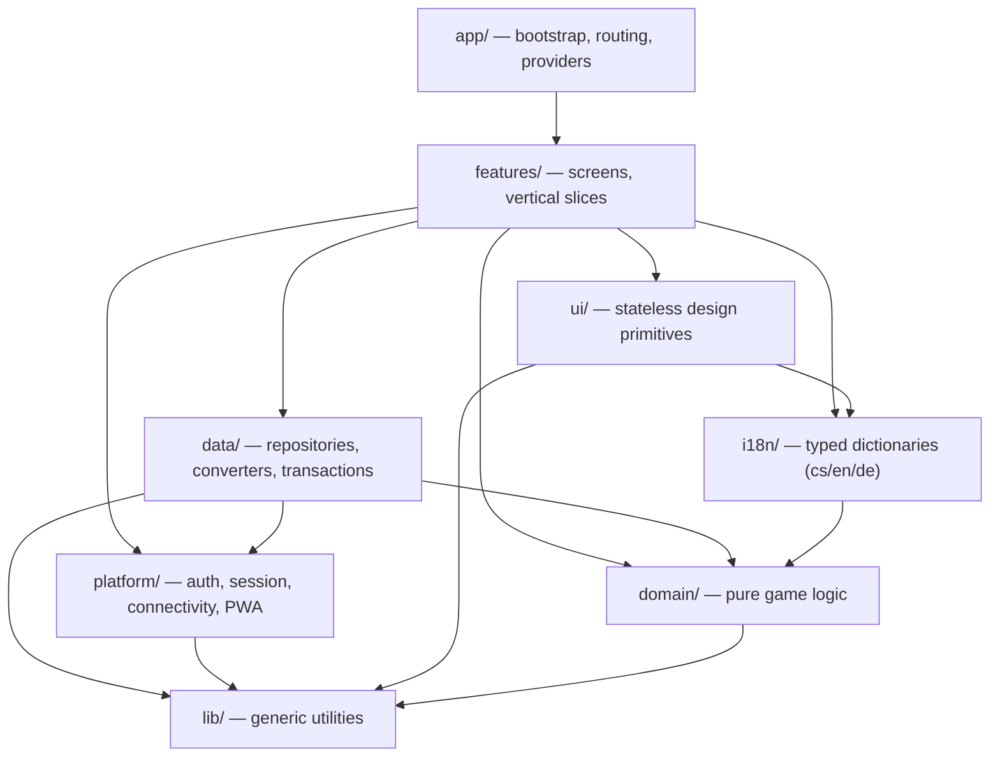

# Táborová hra · Camp Game

A mobile-first Progressive Web App for a game that camp counselors play with kids:
players pick a daily task, earn coins, and spend them on rewards — which are often
small punishments for everyone else. Each evening one admin runs the "day evaluation",
which settles the day and moves the game to the next round.

> Status: **Phase 0 (skeleton).** The app shell, navigation and toolchain are in place;
> game features land phase by phase (see the roadmap below).

No backend and no Cloud Functions: [Firestore](https://firebase.google.com/docs/firestore)
with Anonymous Auth is the single source of truth, and all authorization lives in
Firestore Security Rules. The design is meant to fit comfortably in the free tier.

## Tech stack

- **Vite + React + TypeScript** (strict), `react-router-dom`
- **Tailwind CSS** with semantic design tokens
- **Firebase**: Firestore + Anonymous Auth (modular SDK) — nothing else
- **zod** for validating everything read from Firestore
- **Vitest** + Testing Library + `@firebase/rules-unit-testing`
- **ESLint** (with architecture boundaries), Prettier, husky
- `vite-plugin-pwa` for the service worker and manifest

## Run it

Prerequisites: **Node ≥ 20** and a **JDK (21)** for the Firestore emulator.

```bash
npm install
npm run dev
```

`npm run dev` starts Vite, the Firestore/Auth emulators, and seeds demo data — one
command, no configuration. To work against a real Firebase project instead, copy
`.env.example` to `.env`, fill it in, and run `npm run dev:cloud`.

## Scripts

| Command                           | What it does                          |
| --------------------------------- | ------------------------------------- |
| `npm run dev`                     | Vite + emulators + seed               |
| `npm run verify`                  | lint + typecheck + unit tests + build |
| `npm run test:unit`               | Vitest unit and component tests       |
| `npm run test:rules`              | Firestore rules tests in the emulator |
| `npm run build`                   | Production build                      |
| `npm run lint` / `npm run format` | ESLint / Prettier                     |

## Architecture

Game logic is a pure, framework-free layer with no idea that Firestore or React exist,
so it is fully unit-testable. Each layer may import only from the ones below it; the rule
is enforced by ESLint and CI fails on violations.



## Roadmap

0. **Skeleton** — done
1. Domain (pure game logic + tests)
2. Data + Security Rules
3. Auth & turnuses
4. Players
5. Catalog (TSV import)
6. Game loop (reservations, day evaluation, undo)
7. Rewards
8. PWA & polish
9. Showcase (screenshots, ADRs, deploy)

## License

[MIT](./LICENSE)

---

## Česky

Progresivní webová aplikace (mobil na prvním místě) pro hru, kterou hrají vedoucí na
dětském táboře: hráči si každý den vyberou úkol, vydělávají mince a kupují si za ně
odměny — často trest pro ostatní. Každý večer spustí jeden admin „vyhodnocení dne", které
den zúčtuje a posune hru do dalšího kola.

Bez backendu a bez Cloud Functions: zdrojem pravdy je Firestore s anonymním přihlášením a
veškerá autorizace je v Security Rules. Návrh cílí na free tier.

**Spuštění:** je potřeba **Node ≥ 20** a **JDK (21)** pro Firestore emulátor.

```bash
npm install
npm run dev
```

`npm run dev` spustí Vite, emulátory a naseeduje ukázková data — jeden příkaz, nulová
konfigurace. Proti reálnému projektu: zkopíruj `.env.example` na `.env`, vyplň a spusť
`npm run dev:cloud`.

Postup je po fázích (viz roadmapa výše); herní logika (fáze 1) je čistá, plně testovatelná
vrstva bez Firestore a Reactu.
